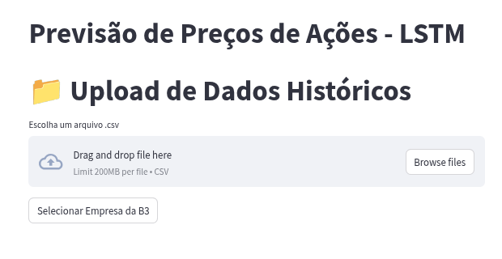
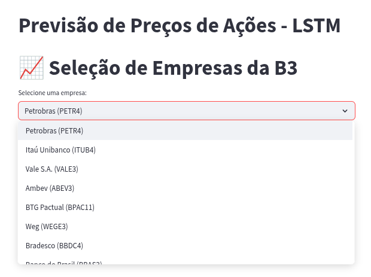
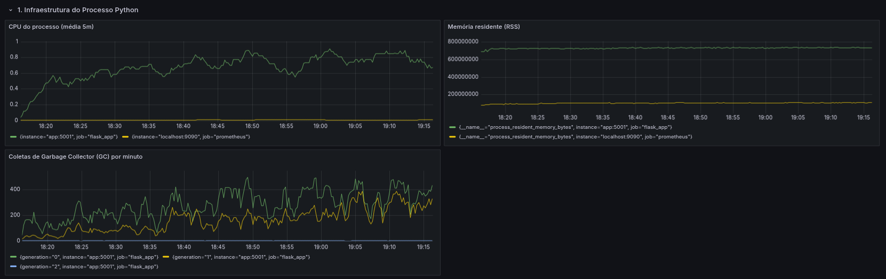
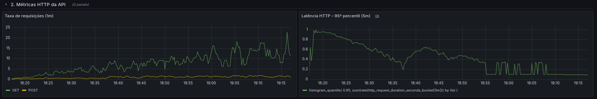
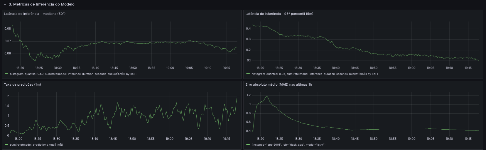

# Tech Challenge Fase 4

## 📖 Descrição
Esta aplicação é um **Tech Challenge** da Fase 4 que demonstra uma pipeline completa de deep learning para séries temporais, usando **LSTM** para prever o preço de fechamento de ações. 

---

## 🎯 Requisitos do Tech Challenge  
Conforme especificado no enunciado, o projeto deve abranger:  
1. **Coleta e Pré-processamento de Dados**  
   - Uso de datasets de preços históricos (ex: Yahoo Finance com `yfinance`)  
2. **Desenvolvimento do Modelo LSTM**  
   - Construção da arquitetura LSTM  
   - Treinamento e ajuste de hiperparâmetros  
   - Avaliação usando métricas como **MAE**, **RMSE** e **MAPE**   
3. **Salvamento e Exportação do Modelo**  
   - Persistência do modelo treinado em formato compatível para inferência  
4. **Deploy da API**  
   - API RESTful em Flask, com upload de CSV e endpoints de predição   
5. **Escalabilidade e Monitoramento**  
   - Métricas de tempo de resposta, consumo de CPU, memória e inferência via Prometheus/Grafana   

---

## 🗂 Estrutura do Projeto

```text
├── downloadData/                 # Coleta e pré-processamento  
│   ├── data/                     # CSVs históricos  
│   └── downloadData.py           # Script de download e ajuste de cabeçalho   
│
├── modelTraining/                # Treinamento e avaliação  
│   └── train_lstm.py             # Script de treino com geração de MAE, RMSE, MAPE   
│
├── app/                          # API e lógica de predição  
│   ├── api/  
│   │   └── app.py                # Flask app, endpoints `/`, `/predict`, `/predict_b3`, `/metrics`, `/health`   
│   ├── models/  
│   │   └── lstm_model.py         # Definição do modelo LSTM  
│   ├── services/  
│   │   └── prediction_service.py # Validação, preprocessamento, inferência e métricas   
│   ├── utils/  
│   │   └── metrics.py            # Definição dos Histograms/Counters/Gauges Prometheus   
│   ├── templates/  
│   │   └── upload.html           # Formulário de upload CSV  
│   ├── config.py                 # Variáveis de ambiente e constantes  
│   └── pyproject.toml            # Configuração do Poetry  
│
├── grafana/                      # Dashboards e provisioning do Grafana  
│   ├── dashboards/  
│   └── provisioning/  
│
├── Docker/                       # Contêineres Docker  
│   ├── Dockerfile                # API Flask + gunicorn + Poetry  
│   ├── docker-compose.yml        # Orquestração: app, Prometheus, Grafana  
│   └── requirements.txt          # Dependências (fallback)  
│
└── README.md                     # Documentação (este arquivo)  
```

---

## ⚙️ Pré-requisitos
- Docker & Docker Compose  
- Python 3.8+ (para treinar localmente)  
- Poetry (gestão de dependências)  

---

## 🚀 Passo a Passo

### 1. Coleta e Pré-processamento
```bash
cd downloadData
python downloadData.py
```
Gera `downloadData/data/<SYMBOL>_data.csv`, já com cabeçalho ajustado. 

### 2. Treinamento e Avaliação
```bash
cd modelTraining
python train_lstm.py
```
- Lê o CSV, pré-processa, treina o LSTM  
- Gera métricas de treino e validação: **MAE**, **RMSE**, **MAPE**   
- Salva  
  - `app/models/lstm_model.keras`  
  - `app/models/scaler.pkl`

### 3. Deploy da API
```bash
cd app
poetry install
poetry run python -m api.app
```
- **API Flask** em http://localhost:5001 

### 4. Contêineres Docker
```bash
cd Docker
docker-compose up --build
```
- **API Flask**: http://localhost:5001  
- **Prometheus**: http://localhost:9090  
- **Grafana**: http://localhost:3000  

---

## 📡 Endpoints da API

| Método   | Rota           | Descrição                                    |
| -------- | -------------- | -------------------------------------------- |
| GET      | `/health`      | Checa status de saúde (`{"status":"healthy"}`) |
| GET      | `/metrics`     | Métricas Prometheus                          |
| GET      | `/`            | Formulário de upload CSV                     |
| POST     | `/predict`     | Previsão a partir de CSV (`predicted_close`) |
| GET/POST | `/predict_b3`  | Previsão para 10 maiores da B3 (`company`)   |

---

## 🖥️ Interface Streamlit

Um aplicativo em **Streamlit** foi preparado para facilitar a interação:

### Carregar CSV
Permite carregar o arquivo CSV com o histórico de preços.  


### Selecionar Ações
Interface para selecionar as ações alvo para previsão.  


---

## 📊 Monitoramento & Dashboards Grafana

Para acompanhar desempenho da API e do modelo em produção:

### Dashboards & Provisioning
- Dashboards prontos em `grafana/dashboards/`  
- Provisioning (datasources e dashboards) em `grafana/provisioning/`

### Métricas Prometheus
**Infraestrutura do Processo Python**  
- CPU (média 5m):  
  ```promql
  rate(process_cpu_seconds_total[5m])
  ```
- Memória residente (RSS):  
  ```promql
  process_resident_memory_bytes
  ```
- GC por minuto:  
  ```promql
  rate(python_gc_objects_collected_total[1m])
  ```
  

**Métricas HTTP da API**  
- Requisições (1m):  
  ```promql
  sum(rate(http_requests_total[1m])) by (method, status)
  ```
- Latência 95º perc. (5m):  
  ```promql
  histogram_quantile(0.95, sum(rate(http_request_duration_seconds_bucket[5m])) by (le))
  ```
  

**Métricas de Inferência do Modelo**  
- Latência inferência 50º perc.:  
  ```promql
  histogram_quantile(0.50, sum(rate(model_inference_duration_seconds_bucket[5m])) by (le))
  ```
- Latência inferência 95º perc.:  
  ```promql
  histogram_quantile(0.95, sum(rate(model_inference_duration_seconds_bucket[5m])) by (le))
  ```
- Taxa de predições (1m):  
  ```promql
  sum(rate(model_predictions_total[1m]))
  ```
- MAE última 1h:  
  ```promql
  avg_over_time(model_prediction_error_absolute[1h])
  ```
  

---

## 📝 Observações
- Ajuste variáveis em `config.py` para apontar `API_HOST` e `API_PORT`.  
- Confira `pyproject.toml` para alinhar versões de dependências.  
- Use as dashboards de exemplo em `grafana/` para monitorar em produção.  